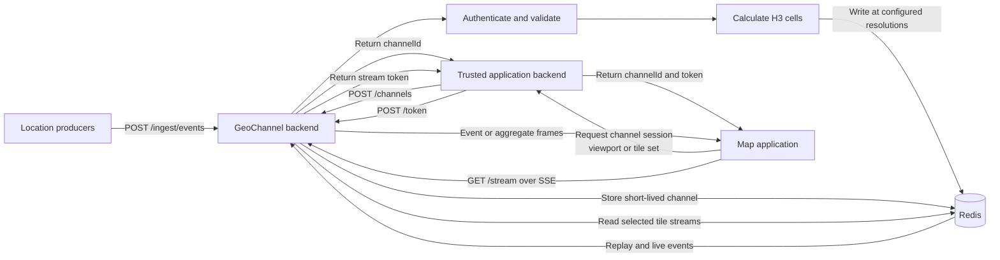
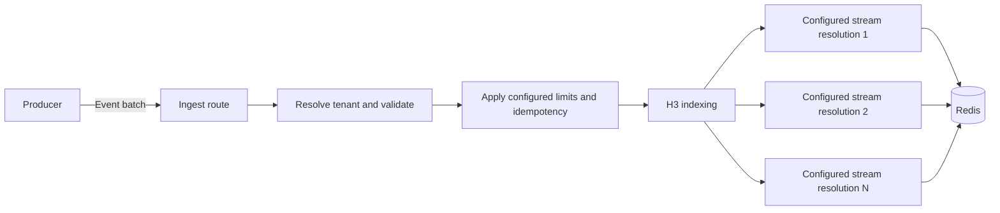
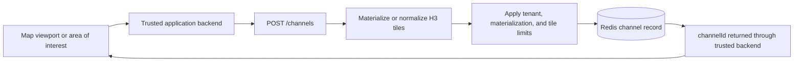
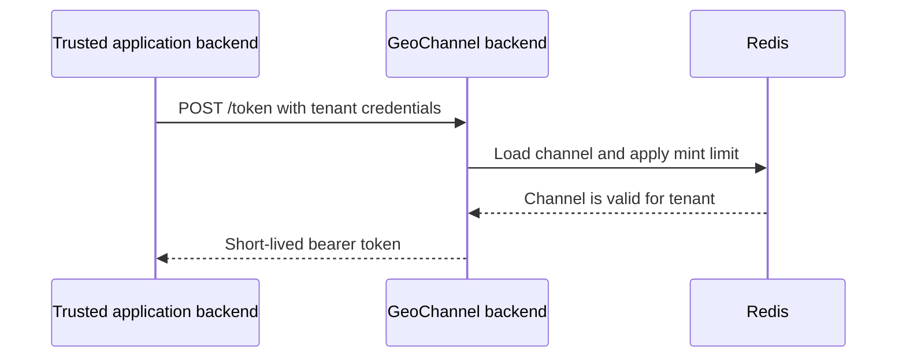
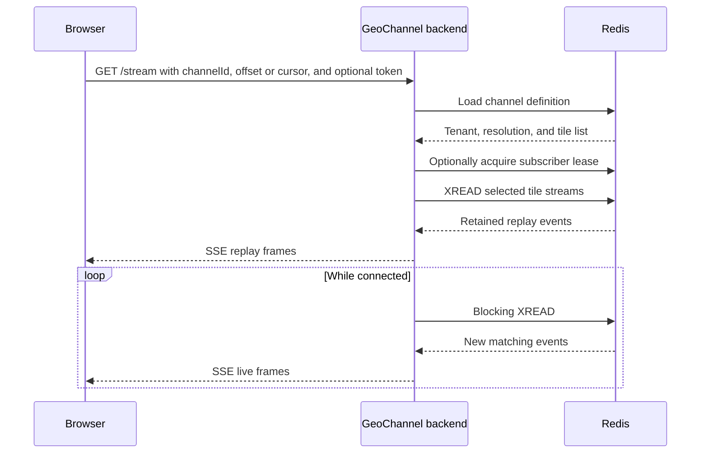
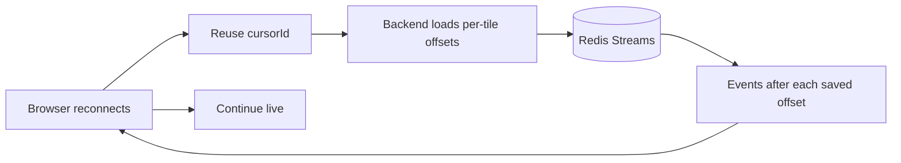
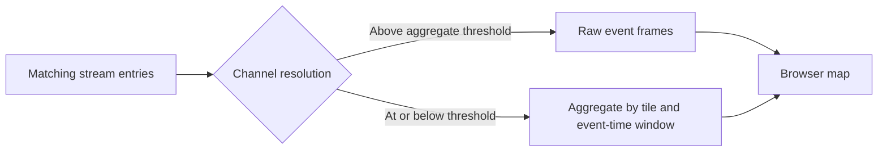
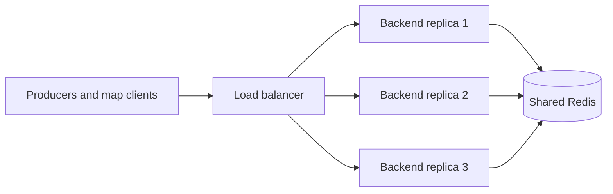
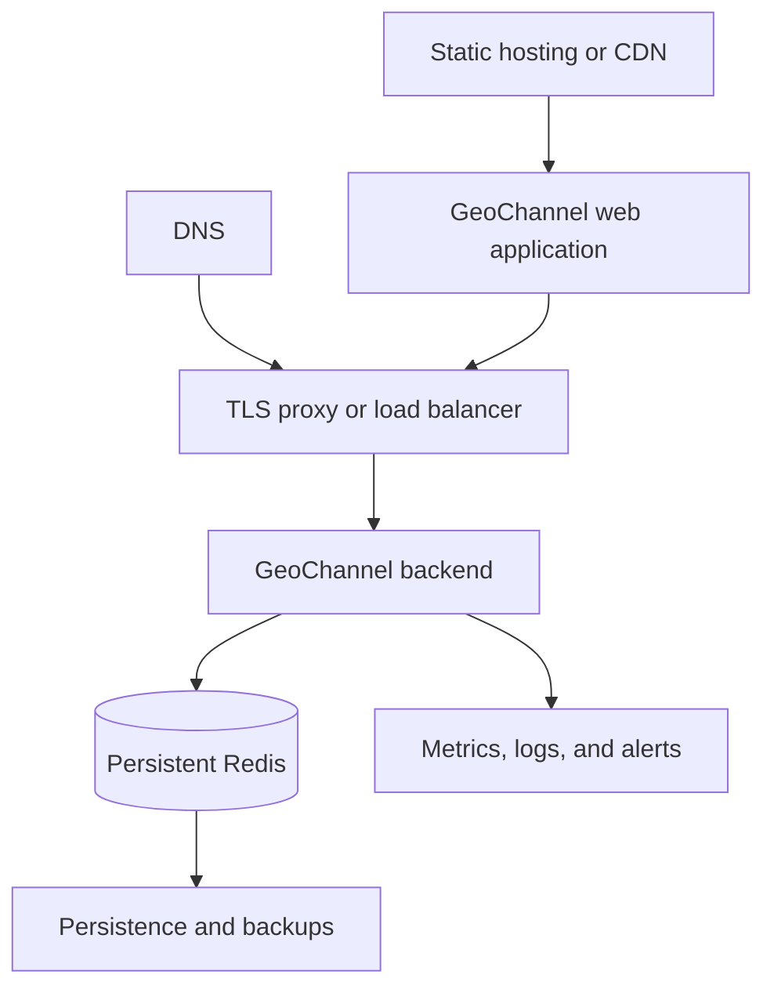

# GeoChannel Architecture

GeoChannel is a spatially indexed, short-term event streaming system. It
accepts location events, writes them into tenant-scoped H3 Redis Streams, and
lets map clients subscribe only to the cells relevant to a viewport or area of
interest.

The backend performs validation, spatial computation, access control, and
stream coordination. Redis holds shared event and control state. The web demo
creates spatial channels and renders replayed and live events on a MapLibre
map.

## System Overview



The core workflow has four stages:

1. Ingest and spatially index events.
2. For external deployments, have trusted application code convert a polygon
   or explicit H3 tile set into a short-lived channel.
3. From the same trusted application boundary, mint a browser-safe token scoped
   to that channel when stream authentication is enabled.
4. Replay and stream matching events over Server-Sent Events (SSE).

## Repository Layout

```text
backend/             Fastify API, Redis stream orchestration, metrics, benchmarks
web/                 Vite + React + MapLibre demo client
packages/contracts/  Shared types, constants, and runtime guards
packages/client/     Reusable channel, token, and fetch-SSE client helpers
examples/             Example trusted integration components
infra/               Local and controlled-deployment Compose configurations
docs/                API, architecture, deployment, and operations docs
scripts/             Repository structure guardrails
```

## 1. Event Ingestion And H3 Indexing

A producer sends a batch of location events to `POST /ingest/events`. The
backend resolves the tenant, validates the payload, optionally applies
idempotency and configured rate or pressure limits, calculates H3 cells, and
writes accepted events into Redis Streams.



H3 divides the world into cells at multiple resolutions. Lower resolutions
cover larger areas; higher resolutions cover smaller areas. The backend first
indexes each event at `H3_RES_INGEST`, then writes that cell or its parent at
every resolution from `H3_RES_STREAM_MIN` through `H3_RES_STREAM_MAX`.

Event stream keys use this pattern:

```text
stream:tenant:<tenantId>:tile:<h3>
```

This creates write amplification:

```text
Redis event writes =
  accepted events × number of configured stream resolutions
```

Each accepted event also consumes backend CPU for authentication, validation,
JSON handling, and H3 indexing; backend-to-Redis bandwidth; Redis CPU and
memory; and persistence I/O when Redis persistence is enabled. Time-based
retention uses approximate `MINID` trimming. When time-based retention is
disabled, approximate `MAXLEN` trimming bounds each stream by entry count.

## 2. Spatial Channel Creation

The client does not put a large H3 tile set into the SSE URL. In an external
deployment, the browser sends its polygon or explicit tile set to trusted
application code, which calls `POST /channels` with tenant credentials. Direct
browser calls are appropriate only for trusted local demos where exposing the
configured tenant key is acceptable. The GeoChannel backend resolves the
tenant, clamps the requested resolution to the configured stream range,
materializes or normalizes the selected cells, enforces configured limits, and
stores a short-lived channel record in Redis.



Conceptually, a channel record contains:

```json
{
  "id": "channel-id",
  "tenantId": "acme",
  "tiles": ["tile-a", "tile-b", "tile-c"],
  "res": 8,
  "aoiRes": 8,
  "ttlSec": 300,
  "createdAt": "2026-06-22T12:00:00.000Z"
}
```

Channel records provide compact stream URLs and a server-side authorization
boundary. Configurable safeguards include polygon point limits, tile
materialization limits, maximum tiles per channel, active channels per tenant,
hourly channel creation, and channel TTL bounds. Channel storage and quota
admission run in one Redis Lua script so concurrent requests cannot bypass the
active or hourly limits through a check-then-write race.

Larger areas generally materialize more tiles. That increases channel creation
CPU and temporary memory, Redis metadata, and subsequent stream and cursor
work.

## 3. Stream-Token Creation

When stream authentication is enabled, trusted application code requests a
short-lived token from `POST /token`. The backend resolves the tenant, loads
the channel, verifies that the tenant matches, applies the configured token
mint limit, and signs a token scoped to the tenant/channel pair.



Tenant API keys belong in trusted application code, not a public browser
bundle. For external deployments, that trusted boundary performs both
`POST /channels` and `POST /token`, then returns the channel ID and short-lived
stream token to the authorized browser. Direct browser calls to either endpoint
are limited to trusted local demos. Token creation primarily uses backend CPU
for HMAC signing and Redis operations for channel lookup and optional rate
limiting.

Authentication is configurable for local development, but externally
accessible deployments should enable channel, token, and stream
authentication as described in [Deployment](DEPLOYMENT.md).

## 4. Replay And Live SSE Streaming

The browser opens `GET /stream?channelId=<channelId>`. The backend loads the
channel, validates a bearer token when stream authentication is enabled,
optionally acquires a subscriber lease, and creates a dedicated Redis
connection for multi-stream `XREAD`. Non-blocking reads provide replay;
blocking reads provide live updates.



The response sends a `ready` event, event or aggregate frames, and keepalive
comments every 15 seconds. It disables proxy buffering with
`X-Accel-Buffering: no`; the external proxy must still support unbuffered,
long-lived responses and preserve `Authorization`.

Each connected viewer consumes:

- One long-lived browser-to-backend HTTP connection
- A backend socket and per-connection state
- A duplicated Redis connection and repeated multi-stream reads
- An outbound queue bounded by pending-frame and pending-byte limits
- Backend CPU for parsing, batching, optional thinning or aggregation, and
  serialization
- Redis-to-backend and backend-to-browser bandwidth

The implementation responds to Node.js stream backpressure, pauses Redis reads
near configured queue limits, and drops the oldest queued frames if necessary
to remain bounded. SSE is therefore a live visualization transport, not a
guaranteed-delivery event log.

## Replay And Resumable Cursors

Redis Streams retain a rolling event window. The `offset` query parameter
controls the initial position:

- `0-0` replays retained entries and then continues live.
- `$` starts with events added after the connection.
- A Redis Stream ID such as `<milliseconds>-<sequence>` resumes after that
  position.

For multi-tile channels, clients can also supply a stable `cursorId`. The
backend stores the last successfully written offset separately for each tile
and prefers those saved positions over the common `offset` on reconnect.



Cursor records expire after `STREAM_CURSOR_TTL_SEC`. A cursor advances when a
frame is written to the HTTP response, not when the browser confirms rendering
it. Retention may also remove entries before a reconnect. Replay and cursors
are therefore intended for short connection recovery, not archival, exactly
once delivery, or long-term analytics.

The reusable client reports stream closure as an error and leaves retry policy
to the caller. The web demo waits briefly, creates a fresh channel and token
when required, and reconnects with the same cursor ID. A deployment draining
an instance should stop routing new requests, allow streams to finish or close
them deliberately, and rely on clients to reconnect. The backend currently
does not include a process-level signal handler that coordinates SSE draining,
so that behavior must be supplied and tested by the runtime or deployment
platform.

## Raw Versus Aggregate Frames

Channels with `res <= STREAM_AGGREGATE_MAX_RES` emit aggregate frames; channels
at higher resolutions emit raw event frames.



Raw event frames preserve the event ID, location, timestamp, tile, offset, and
optionally attributes. They may be batched into one SSE message without
changing the individual frame shape. Optional thinning keeps only the newest
entries from a Redis read when configured.

Aggregate frames are incremental summaries for one tile and event-time window.
They contain a count, average location, latest offset and timestamp, and
average speed when numeric `attrs.speed` values are available. Aggregation
reduces outbound frames and browser feature count at broad map views, while
adding backend CPU and temporary grouping state. Aggregates are not persisted
as a separate data set.

## Redis Storage Model

- Event streams: `stream:tenant:<tenantId>:tile:<h3>`
- Channel records: `chan:<channelId>`
- Active channel quota sets: `tenant:<tenantId>:channels:active`
- Hourly channel quota sets: `tenant:<tenantId>:channels:hourly`
- Ingest idempotency records: `idem:ingest:<tenantId>:<idempotencyKey>`
- Ingest rate-limit keys: `rate:ingest:<tenantId>:<second>`
- Token mint rate-limit keys: `rate:token:<tenantId>:<minute>`
- Stream cursor hashes: `cursor:tenant:<tenantId>:<cursorId>`
- Subscriber lease sets: `subscribers:tenant:<tenantId>` and
  `subscribers:channel:<channelId>`

Redis is both the hot event store and the shared coordination store. Channel
quotas, subscriber admission, idempotency, rate limits, and cursors work across
backend replicas because they use shared Redis state. Each stream connection,
however, reads its selected Redis Streams independently.

## System Resource Model

| Resource | Primary consumers | Typical pressure source |
| --- | --- | --- |
| Backend CPU | Validation, H3 indexing, aggregation, JSON | High ingest or dense matching streams |
| Backend memory | SSE state, frame queues, tile lists | Many viewers or slow clients |
| Backend sockets | Long-lived SSE requests | Concurrent viewers |
| Redis CPU | Stream writes, multi-stream reads, Lua scripts | Events × resolutions and overlapping viewers |
| Redis memory | Events, channels, cursors, quota state | Retention, geography, and payload size |
| Redis connections | Backend control client and per-viewer readers | Concurrent viewers and replicas |
| Disk I/O | Redis persistence and backups | Write rate and retained data |
| Network | Redis writes/reads and browser frames | Event rate, viewers, and payload size |
| Browser CPU/memory | Map features and rendering | Too many raw points |

### Increased Event Volume

```text
More accepted events
  -> more validation and H3 calculations
  -> more Redis writes at each configured resolution
  -> more Redis memory and persistence traffic
  -> more matching frames for connected viewers
```

### Increased Viewer Count

```text
More viewers
  -> more long-lived SSE connections
  -> more duplicated Redis connections and overlapping reads
  -> more backend memory and frame queues
  -> more outbound bandwidth
```

The current implementation has no shared fanout layer. Viewers watching the
same cells independently read overlapping Redis Streams.

### Larger Viewports

```text
Larger area
  -> more H3 tiles at a fixed resolution
  -> larger channel records and cursors
  -> more Redis streams in each XREAD
  -> more replay, filtering, and serialization work
```

Clients can lower the requested H3 resolution to cover broad views with fewer
tiles, subject to configured stream-resolution bounds.

### Longer Retention

```text
Longer retention
  -> more Redis memory
  -> larger persistence files and backups
  -> longer restore time
  -> potentially larger replay bursts
```

Retention is configured per stream write. Redis sizing must account for event
volume, payload size, the number of indexed resolutions, active geography, and
the selected retention policy.

## Horizontal Backend Scaling

Backend replicas can run behind a load balancer and share Redis:



Adding replicas increases backend CPU, memory, socket, and network capacity.
It does not increase Redis CPU, memory, write throughput, or connection limits;
additional replicas and viewers can increase Redis pressure.

Quota and cursor state is shared, but metrics and stream-pressure state are
process-local. Operators must scrape every replica and make scaling decisions
from the combined view. Relevant signals include active streams, pending
frames and bytes, Redis latency and connections, ingest rate, stream latency,
and dropped or thinned frames.

SSE does not require sticky sessions because reconnect state lives in Redis.
During rollout or scale-down, the load balancer should stop sending new
connections to a draining replica before existing connections are closed.
Clients should reconnect through the load balancer with a stable cursor ID and
obtain a fresh channel or token if either has expired.

## Pilot Deployment Shape

The public controlled-deployment guidance uses a bounded, single-region shape:



The included controlled-deployment Compose configuration provides one backend,
one persistent Redis service, and Prometheus. Static web hosting and TLS
termination remain deployment responsibilities. The managed deployment model
described publicly is likewise bounded to one isolated environment, tenant,
region, and live-map workflow with explicit traffic and retention limits.

The sample configuration values are safety defaults and validation inputs, not
capacity guarantees. Operators must establish limits from representative load
tests in their own environment.

## Likely Scaling Stages

These are possible evolution stages, not components already implemented:

1. **Controlled deployment:** one backend, persistent Redis, TLS, secrets,
   authentication, monitoring, backups, and explicit limits.
2. **Backend scale-out:** multiple backend replicas, stronger Redis sizing and
   failover, and per-tenant resource measurements.
3. **High viewer count:** separate ingest and stream-serving workloads and
   introduce shared fanout so overlapping viewers do not each read Redis
   independently.
4. **Long retention or downstream processing:** add a durable event log or
   archive while retaining Redis for hot spatial serving and control state.
5. **Larger distributed platform:** independently scale ingest, spatial
   indexing, stream serving, and control-plane responsibilities when measured
   load and operational complexity justify those boundaries.

GeoChannel scales along two distinct dimensions: accepted event volume and
connected viewers. Both converge on Redis in the current design, so Redis
capacity and stream-serving behavior must be measured independently of backend
replica count.

## Source Boundaries

### Backend

- `backend/src/routes/`: Fastify route handlers and response schemas
- `backend/src/lib/`: shared backend logic and pure helpers
- `backend/src/http/`: transport helpers such as typed API errors
- `backend/src/config.ts`: environment parsing and runtime defaults
- `backend/src/app.ts`: dependency construction and route registration
- `backend/src/index.ts`: process entry point

Backend source must not import from `web/**`.

### Web

- `web/src/features/channels/`: viewport channel creation and stream lifecycle
- `web/src/features/demo-generator/`: synthetic event generation
- `web/src/features/map/`: MapLibre setup and source/layer wiring
- `web/src/features/metrics/`: metrics polling, charts, and dashboard model
- `web/src/features/stream/`: frame-to-GeoJSON storage and pruning
- `web/src/features/ui/`: presentational controls
- `web/src/components/ui/`: reusable UI primitives
- `web/src/lib/`: browser-side shared helpers

Web source must not import from `backend/**`.

### Shared Contracts And Client

Cross-application payload shapes, regex patterns, stream constants, and
runtime guards belong in `@geochannel/contracts`. Reusable JavaScript helpers
for channel creation, token minting, and fetch-based SSE belong in
`@geochannel/client`.

## Repository Structure Guardrails

```bash
npm --prefix backend run check:structure
npm --prefix web run check:structure
```

The guardrail script enforces backend/web import boundaries and keeps checked
source files under the current 450-line limit. Shared behavior should move
into the contracts or client package rather than creating cross-application
source imports.
